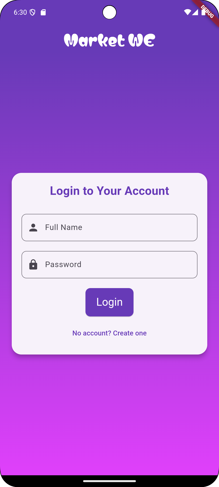
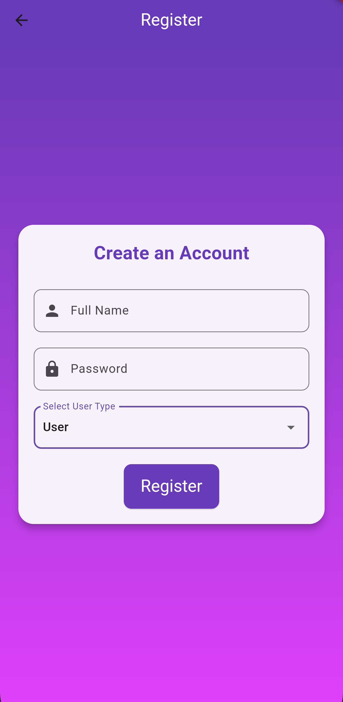

# WE Flutter Diploma 🚀


A comprehensive Flutter learning repository documenting the journey through the WE (Telecom Egypt) Flutter Development Diploma. This repository contains learning sessions, practical projects, and a capstone EV charging station finder application.

## 📚 Repository Structure

```
we_intern/
├── we_flutter_sessions/          # Learning sessions and exercises
│   ├── we_flutter_sessions_1_15/ # Sessions 1-15 (Dart & Flutter Basics)
│   ├── session16/                # Firebase Integration
│   ├── session17/                # E-commerce App (Market WE)
│   └── ---/firbase/             # Firebase Practice Projects
└── we_project/
    └── chargehub/                # Main Capstone Project
```

---

## 🎓 Learning Sessions

### **Sessions 1-15: Dart & Flutter Fundamentals**
Located in: `we_flutter_sessions/we_flutter_sessions_1_15/`

#### Dart Programming (Sessions 1-9)
- **Session 1-3**: Dart basics, variables, data types, control flow
- **Session 4-6**: Functions, collections (Lists, Maps, Sets), error handling
- **Session 7-9**: Object-Oriented Programming
  - Classes and objects
  - Inheritance and polymorphism
  - Abstract classes and interfaces
  - Encapsulation and composition

#### Flutter Development (Sessions 10-15)
- **Session 10**: Flutter basics, widgets, layouts
- **Session 11**: Navigation and routing
  - Task 11.1: Calculator app
  - Task 11.2: Multi-page navigation
  - Task 11.3: Color picker with routing
- **Session 12**: Advanced UI components
  - Task 12.1: Image gallery
  - Task 12.2: Messenger UI clone
- **Session 13**: Local state management
  - Task 13.1: Product app
  - Task 13.2: Local database integration
- **Session 14**: Database operations (SQLite)
- **Session 15**: BLoC State Management
  - Counter app with BLoC
  - User database with BLoC
  - Complete solutions with BLoC pattern

### **Sessions 16-18: Advanced Topics**
Located in: `we_flutter_sessions/session16/`

#### Session 16: Firebase Integration
- Firebase setup and configuration
- Cloud Firestore database
- Real-time data synchronization
- File: `lib/session16 (5-9-2024)/`

#### Session 17: E-Commerce Application
- User authentication
- Product management (CRUD operations)
- Shopping cart functionality
- Admin and user dashboards
- Firebase Storage integration
- File: `lib/session17/`

#### Session 18: Advanced State Management
- BLoC pattern implementation
- Post management system
- User database with BLoC
- Counter app with state management
- File: `lib/session18 (12-9-2024)/`

**Key Technologies:**
- Firebase Authentication
- Cloud Firestore
- Firebase Storage
- SQLite database
- BLoC pattern
- State management

---

## 🚗 Main Project: ChargeHub

**Location:** `we_project/chargehub/`

### Overview
ChargeHub is a comprehensive mobile application for finding electric vehicle (EV) charging stations and gas stations. The app provides real-time location services, user authentication, and detailed vehicle information.

### Features

#### 🔐 Authentication
- Firebase Authentication integration
- User registration and login
- Secure user session management

#### 🗺️ Map Integration
- Interactive map view
- Real-time charging station locations
- Gas station finder
- Distance calculation

#### 🚙 Vehicle Collection
- Electric vehicle database
- Gas vehicle database
- Detailed car specifications
- Visual car galleries

#### 🎨 UI/UX
- Custom splash screen
- Responsive design
- Custom fonts (SofadiOne, QwitcherGrypen, Matemasie)
- Material Design 3

### Tech Stack
```yaml
Dependencies:
- firebase_core: ^3.4.1
- firebase_auth: ^5.2.1
- cloud_firestore: ^5.4.1
- firebase_storage: ^12.3.0
- firebase_messaging: ^15.1.1
- flutter_bloc: (State Management)
- bloc: (Business Logic)
- flutter_map: (Map Integration)
- latlong2: (Location Services)
- http: (API Integration)
- url_launcher: ^6.1.7
- webview_flutter: ^4.0.0
```

### Project Structure
```
chargehub/
├── lib/
│   ├── main.dart
│   ├── firebase_options.dart
│   ├── pages/
│   │   ├── splachScreen.dart
│   │   ├── login.dart
│   │   ├── signup.dart
│   │   ├── evHomePage.dart
│   │   ├── mapScreen.dart
│   │   ├── firebaseAuth.dart
│   │   └── cars/
│   │       ├── cars.dart
│   │       ├── evCars.dart
│   │       └── gasCars.dart
│   ├── bloc/
│   │   ├── logic.dart
│   │   └── state.dart
│   └── repeated/
│       └── button.dart
├── assets/
│   ├── images/
│   │   ├── chargeHub.png
│   │   ├── evCar/
│   │   └── gasCar/
│   └── fonts/
└── firebase.json
```

---

## 📱 Additional Projects

### Market WE - E-Commerce Platform
**Location:** `we_flutter_sessions/session17/market_we/`

A complete e-commerce solution with:
- Product listing and details
- Shopping cart management
- User and admin dashboards
- Order processing
- Firebase backend integration

### Firebase Practice Projects
**Location:** `we_flutter_sessions/---/firbase/`, `firbase2/`, `firbase3/`

Multiple Firebase integration examples:
- Authentication flows
- Firestore CRUD operations
- Real-time updates
- Storage management
- Post management system
- EV app prototypes with login/signup

---

## 🛠️ Getting Started

### Prerequisites
- Flutter SDK 3.4.4 or higher
- Dart SDK 3.4.4 or higher
- Android Studio / VS Code
- Firebase account
- Git

### Installation

1. **Clone the repository**
   ```bash
   git clone https://github.com/YoussefSalem582/WE_Flutter_Diploma.git
   cd we_intern
   ```

2. **Install Flutter dependencies**
   ```bash
   # For ChargeHub project
   cd we_project/chargehub
   flutter pub get
   
   # For Session projects
   cd ../../we_flutter_sessions/session16
   flutter pub get
   ```

3. **Firebase Setup**
   - Create a Firebase project at [console.firebase.google.com](https://console.firebase.google.com)
   - Add your Android/iOS app
   - Download `google-services.json` (Android) and `GoogleService-Info.plist` (iOS)
   - Place configuration files in respective platform folders
   - Enable Firebase Authentication, Firestore, and Storage

4. **Run the application**
   ```bash
   flutter run
   ```

### Running Specific Projects

```bash
# Run ChargeHub
cd we_project/chargehub
flutter run

# Run Session 16
cd we_flutter_sessions/session16
flutter run

# Run Market WE
cd we_flutter_sessions/session17/market_we
flutter run
```

---

## 📖 Learning Resources

### Dart Notes
Located in: `we_flutter_sessions/we_flutter_sessions_1_15/Dart Notes/`
- Session1.txt - Session6.txt
- Comprehensive Dart programming notes
- Code examples and explanations

### Session Documentation
Each session folder contains:
- Source code with detailed comments
- Task solutions
- UI screenshots
- README files with instructions

---

## 🎯 Key Learning Outcomes

### Dart Programming
✅ Variables, data types, and operators  
✅ Control flow and loops  
✅ Functions and closures  
✅ Collections (Lists, Maps, Sets)  
✅ Object-Oriented Programming  
✅ Exception handling  
✅ Async programming (Future, async/await)  

### Flutter Development
✅ Widget tree and composition  
✅ Stateful and Stateless widgets  
✅ Navigation and routing  
✅ State management (setState, BLoC)  
✅ Local storage (SQLite)  
✅ UI/UX design principles  
✅ Responsive layouts  

### Backend Integration
✅ Firebase Authentication  
✅ Cloud Firestore database  
✅ Firebase Storage  
✅ Real-time data synchronization  
✅ REST API integration  
✅ Error handling and validation  

### Architecture & Patterns
✅ BLoC pattern  
✅ Repository pattern  
✅ Clean architecture principles  
✅ State management best practices  
✅ Code organization and structure  

---

## 📸 Screenshots

### ChargeHub App


### Market WE




### Other Apps
- Calculator: `we_flutter_sessions/photos/calculator.jpg`
- Messenger: `we_flutter_sessions/photos/massenger.png`
- Database Examples: `we_flutter_sessions/photos/database.png`

---

## 🤝 Contributing

This is a learning repository, but contributions and suggestions are welcome!

1. Fork the repository
2. Create your feature branch (`git checkout -b feature/AmazingFeature`)
3. Commit your changes (`git commit -m 'Add some AmazingFeature'`)
4. Push to the branch (`git push origin feature/AmazingFeature`)
5. Open a Pull Request

---

## 📝 License

This project is created for educational purposes as part of the WE Flutter Development Diploma.

---

## 👨‍💻 Author

**Youssef Salem**
- GitHub: [@YoussefSalem582](https://github.com/YoussefSalem582)
- Repository: [WE_Flutter_Diploma](https://github.com/YoussefSalem582/WE_Flutter_Diploma)

---

## 🙏 Acknowledgments

- **WE (Telecom Egypt)** - For providing the Flutter Development Diploma program
- **Flutter Team** - For the amazing framework
- **Firebase Team** - For backend services
- **Flutter Community** - For resources and support

---

## 📞 Contact & Support

For questions or support related to this repository:
- Open an issue on GitHub
- Contact through the repository

---

## 🗓️ Project Timeline

- **Started:** July 2024
- **Dart Sessions:** July - August 2024
- **Flutter Sessions:** August - September 2024
- **Final Project:** September 2024 - Present
- **Last Updated:** November 2025

---

## 🔄 Recent Updates

### November 2025
- Repository documentation completed
- README file created
- Project structure organized
- Screenshots and assets documented

### September 2024
- ChargeHub project finalized
- Firebase integration completed
- BLoC state management implemented
- Market WE e-commerce platform completed

---

## 📚 Additional Resources

### Documentation
- [Flutter Documentation](https://flutter.dev/docs)
- [Dart Documentation](https://dart.dev/guides)
- [Firebase Documentation](https://firebase.google.com/docs)
- [BLoC Library](https://bloclibrary.dev/)

### Tutorials Used
- WE Flutter Diploma Course Materials
- Flutter Official Tutorials
- Firebase Integration Guides

---

<div align="center">

### ⭐ If you find this repository helpful, please give it a star! ⭐

**Made with ❤️ and Flutter**

</div>
